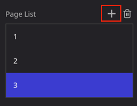
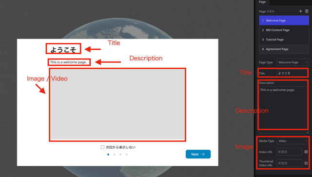
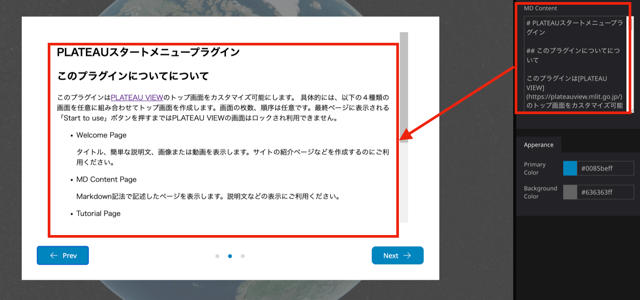
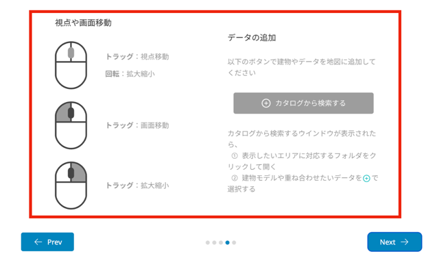
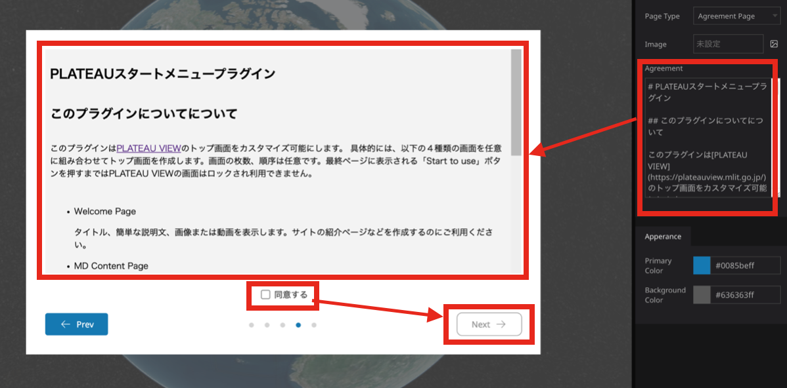
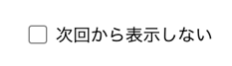
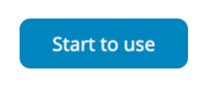
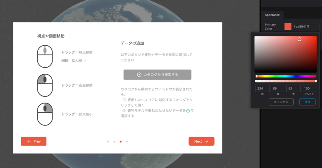
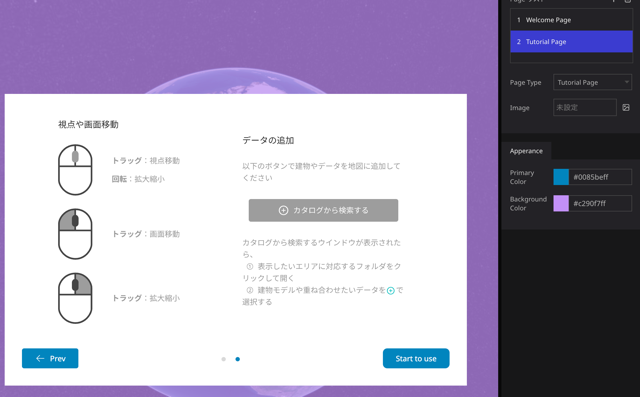

# PLATEAUスタートメニュープラグイン

## このプラグインについてについて

このプラグインは[PLATEAU VIEW](https://plateauview.mlit.go.jp/)のトップ画面をカスタマイズ可能にします。
具体的には、以下の４種類の画面を任意に組み合わせてトップ画面を作成します。画面の枚数、順序は任意です。最終ページに表示される「Start to use」ボタンを押すまではPLATEAU VIEWの画面はロックされ利用できません。

- Welcome Page

   タイトル、簡単な説明文、画像または動画を表示します。サイトの紹介ページなどの作成にご利用ください。

- MD Content Page

   Markdown記法で記述したページを表示します。説明文などの表示にご利用ください。

- Tutorial Page

   使い方の説明です。あらかじめデザインされたページが表示されます。

- Agreement Page

   Markdown記法で記述したページを表示します。ページ下部にチックボックスが表示され、チェックすると先に進むボタンが押せる様になります。利用許諾などのページとしてご利用頂けます。

## 使用方法

   左パネルの Widget で本プラグインを指定すると、右パネルに Page List が表示されます。 ’＋’ ボタンを押すとページが追加されます。

   

   以下、Page Type毎に使用方法を説明します。

### Welcome Page

   Welcome Pageの設定項目です。

   - Title
   
      画面上部に表示するタイトルです。

   - Description

      説明文です。Titleの下に表示されます。

   - Media Type

      ページ中央の画像領域に表示するデータの種類を指定します。指定できるのはImageまたはVideoです。

   - Image

      Media TypeにImageを指定した場合、ここで設定した画像が表示されます。jpeg, PNGなどの画像が指定可能です。

   - Video URL

      Media TypeにVideoを指定した場合、ここで設定したURLのVideoが再生されます。YouTubeなどの動画サイトの埋め込み再生に対応しています。

   - Thumnail Video URL

      Media TypeにVideoを指定した場合、ここで設定した画像が動画再生前の初期画像として表示されます。jpeg, PNGなどの画像が指定可能です。

   
   
###  MD Content Page

   MD Content欄に記述したMarkdown形式の文書を表示します。

   

### Tutorial Page

   プラグインにあらかじめ組み込まれた操作説明を表示します。右パネルの設定項目はありません。

   

### Agreement Page

   使用許諾を表示するページです。右パネルのAgreement欄に入力したMarkdown形式の文書を表示します。ページ下部の「同意する」チェックボックスをチェックするとNextボタンが押せる様になります。
   
   

### Other settings

   - 「次回から表示しない」チェックボックス

      1ページ目の下部に「次回から表示しない」チェックボックスが表示されます。チェックすると次回起動時からPLATEAUスタートメニューは表示されなくなります。表示を再開するにはCookieの削除が必要です。

   å

   - 「Start to use」ボタン

      最終ページでは「Next」ではなく「Start to use」ボタンが表示されます。このボタンを押すとPLATEAUスタートメニューの画面は終了し、PLATEAU Viewが利用可能になります。

   

   - Primary Color

      「Primary Color」でボタンの背景色、ページインデックスの色を変更できます。

   

   - Background Color

      「Background Color」でメニューの背景色を変更できます。

   

